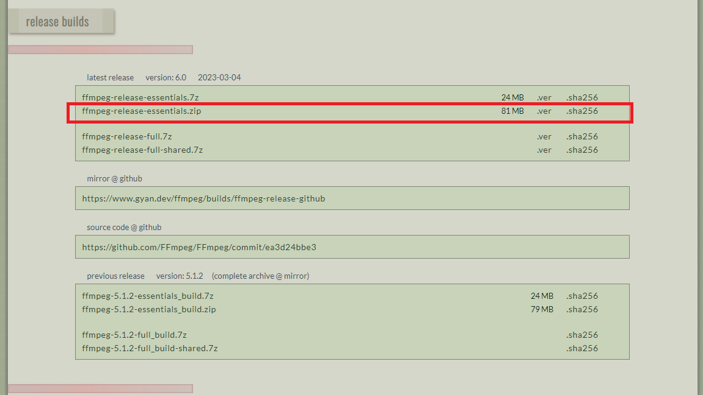
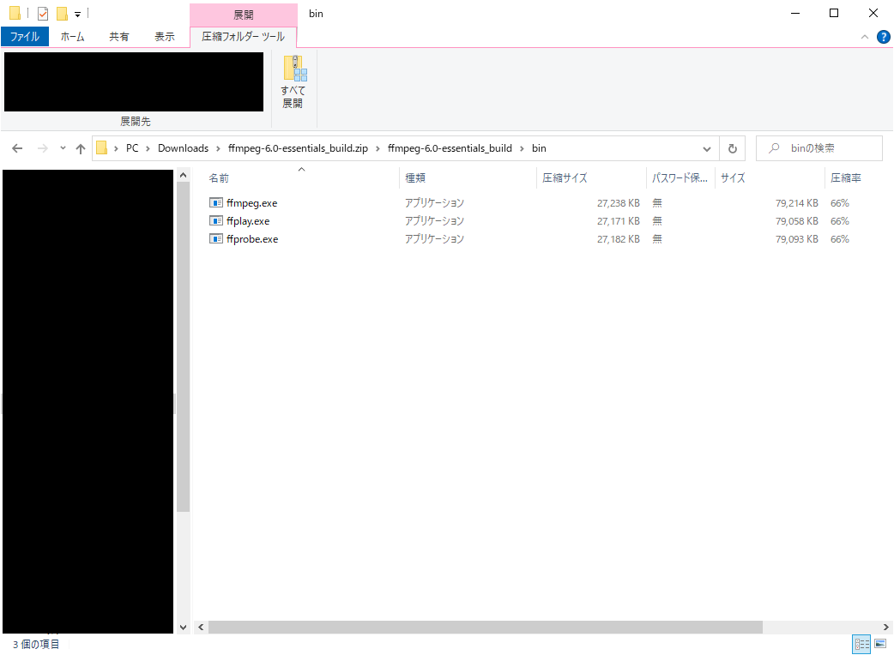
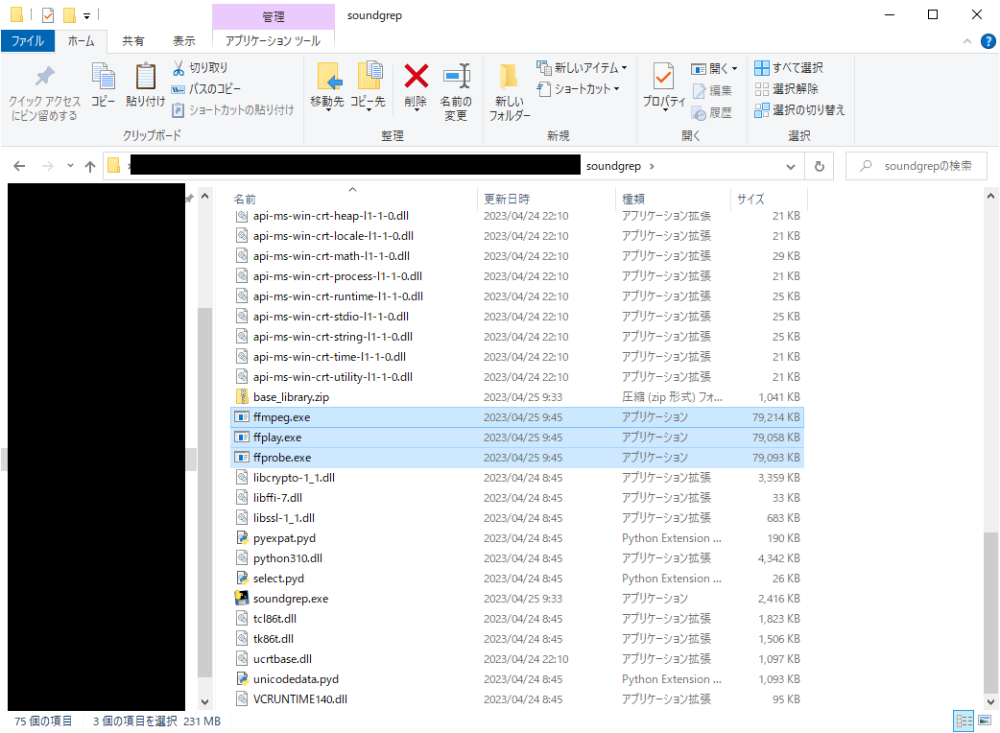
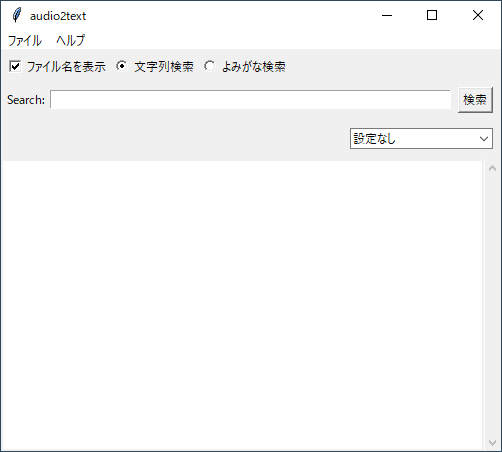
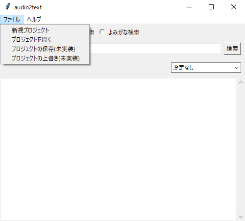
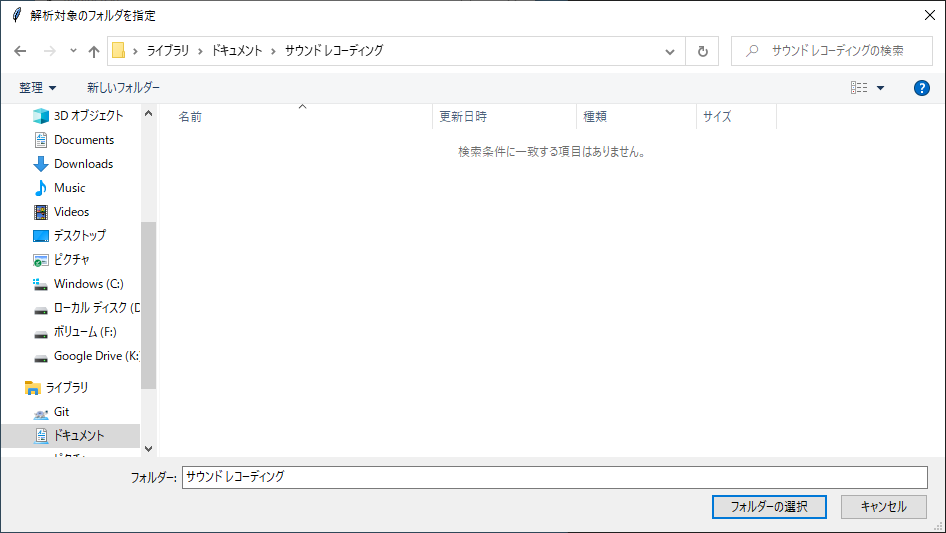
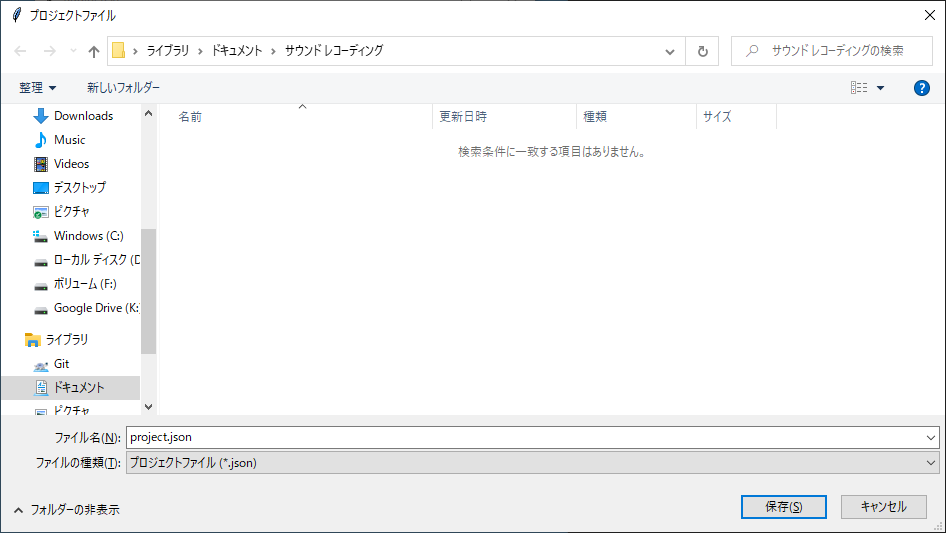
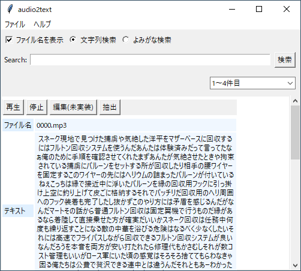
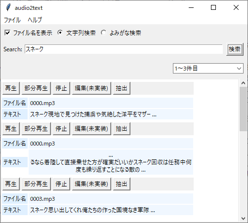
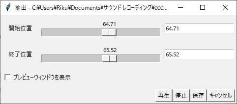

# sound2text
soundgrepは大量の音声ファイルや動画ファイルのセリフや会話を文字列解析し、その解析結果を横断的に検索できるアプリケーションです。動作確認はWindows版しか行ってません。

簡単な説明動画↓

## 導入方法
### アプリケーションのダウンロード
GitHubのReleaseからもっとも新しいものを選んでダウンロードしてください。

### 音声解析ツールキット「vosk」のモデルを配置する
https://alphacephei.com/vosk/models

### ffmpegの配置
ffmpeg, ffplay, ffprobeのパスを通してください。

パスを通すの意味が分からない方は、以下の手順で必要なファイルを配置してください。

#### 1. ffmpegの入手
以下のサイトにアクセスし、新しいバージョンの「ffmpeg-release-essentials.zip」をダウンロードしてください。

https://www.gyan.dev/ffmpeg/builds/

#### 2.ffmpegの配置
「ffmpeg-release-essentials.zip」をクリックすると、「ffmpeg-x.x-essentials_build」というフォルダの中に「bin」フォルダがあると思います。その中身をすべてコピーしてください。

コピーしたファイルを「soundgrep」のフォルダに貼り付けてください。

## 使い方
例を用いて使い方を示します。例では昔好きだったゲームを録音したデータを使用しています。

### 音声ファイルの解析

"soundgrep.exe"を実行します。

「ファイル」>「新規プロジェクト」を選びます。

解析対象のフォルダを選択してください。選択したフォルダの直下だけでなく、その下のフォルダまで再帰的に検索されます。また、初期設定では".mp3", ".wav", ".aac", ".mp4", ".avi"の拡張子のものを解析します。解析対象の拡張子は設定で変更できます。

解析結果データを出力する際のファイル名を選んでください。ファイルは解析対象のフォルダの直下に保存してください。

※このように保存することで、次回以降解析結果への検索を高速化しています。

検索結果は以下のような物になります。

"Search:"に検索したい文字列を入力し、「検索」ボタンを押すと解析結果から該当する文字列を検索します。

各機能の説明は以下の通り。

|表示|説明|
|:-|:-|
|ファイル名を表示|チェックを入れると、結果画面にファイル名を表示します|
|文字列検索|解析結果の文字列から検索します|
|よみがな検索|解析結果の文字列を読み仮名に（無理矢理）変換したものから検索します|
|再生|ファイルを最初から再生します|
|部分再生|検索にヒットした部分のみトリミングして再生します ファイルによっては、内部データの使用により1ループ目は正しい位置からループされないことがありますが、我慢してください|
|停止|再生を停止します|
|編集|今後実装予定|
|抽出|ファイルから一部分をトリミングして保存するためのウィンドウを開く|

### 抽出
「抽出」ボタンを押すと以下のようなウィンドウが表示されます。

|表示|説明|
|:-|:-|
|開始位置|チェックを入れると、結果画面にファイル名を表示します|
|終了位置|解析結果の文字列から検索します|
|プレビューウィンドウを表示|チェックするとプレビューウィンドウを表示します 動画ファイルを選択している場合はチェックすると分かりやすいです|
|再生|開始位置から終了位置までトリミングして再生します ファイルによっては、内部データの使用により1ループ目は正しい位置からループされないことがありますが、我慢してください|
|停止|再生を停止します|
|保存|開始位置から終了位置まで切り抜いてファイルを保存します 保存の際に指定した拡張子からコーデックを自動判別して保存するので、音声ファイルなら".mp3"、動画ファイルなら".mp4"を末尾につけてください|
|終了|ファイルから一部分をトリミングして保存するためのウィンドウを開く|
